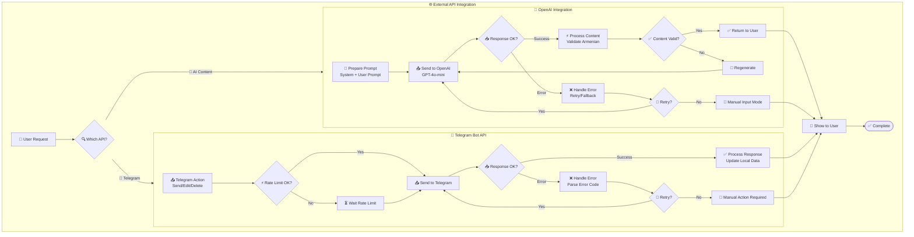
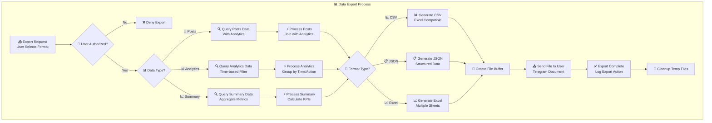
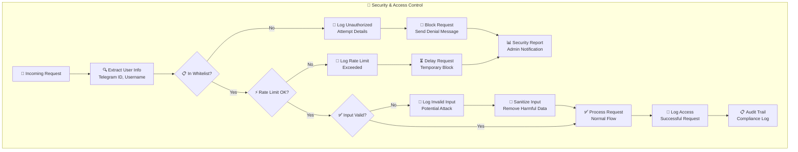

# 🔄 TimeToShopping_bot Flow Chart Documentation

## Main User Flow Diagram

```mermaid
flowchart TD
    Start([👤 User Starts Bot]) --> Auth{🔐 User Authorized?}
    Auth -->|No| Deny[❌ Access Denied<br/>Contact Admin]
    Auth -->|Yes| MainMenu[🏠 Main Menu<br/>- New Post<br/>- Drafts<br/>- Scheduled<br/>- Analytics<br/>- Settings<br/>- Help]
    
    MainMenu --> NewPost[📝 New Post]
    MainMenu --> ViewDrafts[📋 View Drafts]
    MainMenu --> ViewScheduled[⏰ View Scheduled]
    MainMenu --> ViewStats[📊 View Analytics]
    MainMenu --> Settings[🔧 Settings]
    MainMenu --> Help[ℹ️ Help]
    
    NewPost --> PostFlow
    ViewDrafts --> DraftActions
    ViewScheduled --> ScheduledActions
    ViewStats --> StatsFlow
    
    subgraph PostFlow ["📝 Post Creation Flow"]
        FormatSelect[🎯 Select Format<br/>🔥 Selling<br/>📝 Collection<br/>💡 Info<br/>⚡ Promo] 
        --> EnterKeywords[📝 Enter Keywords<br/>Main topics, products]
        --> EnterDetails[📝 Additional Details<br/>(Optional)]
        --> AIGen[🤖 AI Generation<br/>GPT-4o Armenian]
        
        AIGen --> GenSuccess{✅ Generation Success?}
        GenSuccess -->|No| GenError[❌ Generation Failed<br/>Try Again]
        GenError --> EnterKeywords
        GenSuccess -->|Yes| ReviewText[👀 Review Generated Text]
        
        ReviewText --> TextAction{📝 Text Action}
        TextAction -->|✅ Approve| AddMedia[🖼️ Add Media]
        TextAction -->|✏️ Edit| EditText[✏️ Manual Edit]
        TextAction -->|🔄 Regenerate| AIGen
        
        EditText --> AddMedia
        
        AddMedia --> MediaChoice{🎥 Media Type}
        MediaChoice -->|🖼️ Photo| UploadPhoto[📤 Upload Photo]
        MediaChoice -->|🎥 Video| UploadVideo[📤 Upload Video]
        MediaChoice -->|🎞️ GIF| UploadGIF[📤 Upload GIF]
        MediaChoice -->|🚫 No Media| FinalPreview
        
        UploadPhoto --> FinalPreview[👁️ Final Preview<br/>Media + Text]
        UploadVideo --> FinalPreview
        UploadGIF --> FinalPreview
        
        FinalPreview --> PostAction{🎯 Post Action}
        PostAction -->|✅ Publish Now| PublishNow[🚀 Publish to Channel]
        PostAction -->|🕒 Schedule| ScheduleFlow
        PostAction -->|✏️ Edit More| ReviewText
        PostAction -->|❌ Delete| DeleteDraft[🗑️ Delete Draft]
    end
    
    subgraph ScheduleFlow ["🕒 Scheduling Flow"]
        CalendarPicker[📅 Select Date<br/>Calendar Interface] 
        --> DateValid{📅 Valid Date?}
        DateValid -->|No| CalendarPicker
        DateValid -->|Yes| TimePicker[🕐 Select Time<br/>Predefined/Custom]
        
        TimePicker --> TimeValid{🕐 Valid Time?}
        TimeValid -->|No| TimePicker
        TimeValid -->|Yes| ScheduleConfirm[✅ Schedule Confirmed<br/>Job Created]
        
        ScheduleConfirm --> ScheduledSuccess[⏰ Post Scheduled<br/>APScheduler Job]
    end
    
    PublishNow --> PublishSuccess{📤 Publish Success?}
    PublishSuccess -->|Yes| ChannelPosted[📢 Posted to Channel<br/>Analytics Logged]
    PublishSuccess -->|No| PublishError[❌ Publish Failed<br/>Retry/Draft]
    
    PublishError --> PostAction
    ChannelPosted --> MainMenu
    ScheduledSuccess --> MainMenu
    DeleteDraft --> MainMenu
    
    subgraph DraftActions ["📋 Draft Management"]
        DraftList[📝 List Drafts] --> SelectDraft[👆 Select Draft]
        SelectDraft --> DraftPreview[👁️ Preview Draft]
        DraftPreview --> DraftAction{🎯 Draft Action}
        DraftAction -->|✅ Publish| PublishNow
        DraftAction -->|🕒 Schedule| ScheduleFlow
        DraftAction -->|✏️ Edit| EditDraft[✏️ Edit Draft]
        DraftAction -->|❌ Delete| DeleteDraft
        
        EditDraft --> ReviewText
    end
    
    subgraph ScheduledActions ["⏰ Scheduled Management"]
        ScheduledList[📅 List Scheduled] --> SelectScheduled[👆 Select Scheduled]
        SelectScheduled --> ScheduledPreview[👁️ Preview Scheduled]
        ScheduledPreview --> ScheduledAction{🎯 Scheduled Action}
        ScheduledAction -->|✅ Publish Now| PublishNow
        ScheduledAction -->|🕒 Reschedule| ScheduleFlow
        ScheduledAction -->|❌ Cancel| CancelScheduled[❌ Cancel Schedule]
        
        CancelScheduled --> MainMenu
    end
    
    subgraph StatsFlow ["📊 Analytics Flow"]
        StatsMenu[📊 Analytics Menu<br/>📅 Daily<br/>📊 Weekly<br/>🏆 Top Posts<br/>📈 Formats<br/>📄 Export] 
        --> StatsChoice{📈 Stats Type}
        
        StatsChoice -->|📅| DailyStats[📅 Daily Statistics<br/>Posts, Clicks, Views]
        StatsChoice -->|📊| WeeklyStats[📊 Weekly Statistics<br/>Trends, Performance]
        StatsChoice -->|🏆| TopPosts[🏆 Top Posts<br/>Best Performers]
        StatsChoice -->|📈| FormatStats[📈 Format Statistics<br/>Performance by Type]
        StatsChoice -->|📄| ExportStats[📄 Export Data<br/>CSV/JSON Download]
        
        DailyStats --> StatsDisplay[📋 Display Results]
        WeeklyStats --> StatsDisplay
        TopPosts --> StatsDisplay
        FormatStats --> StatsDisplay
        ExportStats --> FileDownload[📁 File Download]
        
        StatsDisplay --> MainMenu
        FileDownload --> MainMenu
    end
```

## Background Process Flow

```mermaid
flowchart TD
    subgraph BackgroundJobs ["🔄 Background Processes"]
        SchedulerCheck[⏰ Scheduler Check<br/>Every 1 minute] --> CheckDue{📅 Posts Due?}
        CheckDue -->|No| Wait[⏳ Wait 1 minute]
        CheckDue -->|Yes| GetPosts[📋 Get Due Posts]
        
        Wait --> SchedulerCheck
        
        GetPosts --> ProcessPost[🔄 Process Each Post]
        ProcessPost --> ValidatePost{✅ Post Valid?}
        
        ValidatePost -->|No| LogError[📝 Log Error]
        ValidatePost -->|Yes| PublishToChannel[📤 Publish to Channel]
        
        PublishToChannel --> PublishSuccess{📤 Success?}
        PublishSuccess -->|Yes| UpdateStatus[✅ Update Status<br/>Mark as Published]
        PublishSuccess -->|No| RetryLater[🔄 Schedule Retry<br/>+5 minutes]
        
        UpdateStatus --> LogAnalytics[📊 Log Analytics<br/>Publish Action]
        RetryLater --> LogError
        LogError --> NextPost{📝 More Posts?}
        LogAnalytics --> NextPost
        
        NextPost -->|Yes| ProcessPost
        NextPost -->|No| SchedulerCheck
    end
    
    subgraph AnalyticsTracking ["📊 Analytics Tracking"]
        UserAction[👤 User Action<br/>Click, View, Share] --> ExtractData[🔍 Extract Data<br/>Post ID, User ID, Action]
        ExtractData --> ValidateData{✅ Valid Data?}
        ValidateData -->|No| DropAction[❌ Drop Action]
        ValidateData -->|Yes| LogToDB[💾 Log to Database<br/>Analytics Table]
        
        LogToDB --> UpdateCounters[📊 Update Counters<br/>Real-time Stats]
        UpdateCounters --> CacheStats[⚡ Cache Statistics<br/>Performance]
        
        CacheStats --> AnalyticsReady[📈 Analytics Ready<br/>For Dashboard]
    end
    
    subgraph ErrorHandling ["❌ Error Handling"]
        Error[💥 Error Occurs] --> ClassifyError{🔍 Error Type}
        ClassifyError -->|🔒 Auth Error| BlockUser[🚫 Block User<br/>Log Attempt]
        ClassifyError -->|🤖 AI Error| RetryAI[🔄 Retry AI Call<br/>Fallback Mode]
        ClassifyError -->|💾 DB Error| RetryDB[🔄 Retry Database<br/>Exponential Backoff]
        ClassifyError -->|📡 API Error| RetryAPI[🔄 Retry API Call<br/>Rate Limit Handling]
        
        BlockUser --> LogSecurity[📝 Security Log]
        RetryAI --> AISuccess{✅ AI Success?}
        RetryDB --> DBSuccess{✅ DB Success?}
        RetryAPI --> APISuccess{✅ API Success?}
        
        AISuccess -->|No| FallbackMode[🔧 Manual Mode<br/>User Input Required]
        AISuccess -->|Yes| Continue[✅ Continue Process]
        
        DBSuccess -->|No| EmergencyMode[🆘 Emergency Mode<br/>Read-only]
        DBSuccess -->|Yes| Continue
        
        APISuccess -->|No| DelayRetry[⏳ Delay & Retry<br/>Exponential Backoff]
        APISuccess -->|Yes| Continue
        
        Continue --> NormalOperation[✅ Normal Operation]
        FallbackMode --> NormalOperation
        EmergencyMode --> AdminNotify[📢 Notify Admin]
        DelayRetry --> RetryAPI
    end
```



## Database Transaction Flow

```mermaid
flowchart TD
    subgraph DatabaseFlow ["💾 Database Operations"]
        StartTx[🔄 Start Transaction] --> ValidateInput{✅ Validate Input}
        ValidateInput -->|Invalid| RollbackTx[🔙 Rollback Transaction]
        ValidateInput -->|Valid| ExecuteQuery[⚡ Execute Query]
        
        ExecuteQuery --> QuerySuccess{✅ Query Success?}
        QuerySuccess -->|No| HandleError[❌ Handle DB Error]
        QuerySuccess -->|Yes| CommitTx[✅ Commit Transaction]
        
        HandleError --> RetryQuery{🔄 Retry?}
        RetryQuery -->|Yes| ExecuteQuery
        RetryQuery -->|No| RollbackTx
        
        CommitTx --> LogSuccess[📝 Log Success]
        RollbackTx --> LogError[📝 Log Error]
        
        LogSuccess --> UpdateCache[⚡ Update Cache]
        LogError --> NotifyError[🚨 Notify Error]
        
        UpdateCache --> Complete[✅ Complete]
        NotifyError --> Complete
    end
    
    subgraph PostLifecycle ["📝 Post Lifecycle"]
        CreatePost[➕ Create Post<br/>Status: Draft] --> EditPost[✏️ Edit Post<br/>Multiple Times]
        EditPost --> ReadyToPublish{🚀 Ready?}
        
        ReadyToPublish -->|Schedule| SchedulePost[🕒 Schedule Post<br/>Status: Scheduled]
        ReadyToPublish -->|Publish Now| PublishPost[📤 Publish Post<br/>Status: Published]
        ReadyToPublish -->|Save Draft| SaveDraft[💾 Save Draft<br/>Keep as Draft]
        
        SchedulePost --> WaitSchedule[⏳ Wait for Schedule]
        WaitSchedule --> PublishPost
        
        PublishPost --> TrackAnalytics[📊 Track Analytics<br/>Views, Clicks, Shares]
        SaveDraft --> EditPost
        
        TrackAnalytics --> ArchivePost[📦 Archive Post<br/>After 30 days]
        ArchivePost --> EndOfLife[⚰️ End of Lifecycle]
    end
```



## Integration Flow



## Data Export Flow



## Security Flow



---

These flow charts provide a comprehensive visual guide to all the major processes in the TimeToShopping_bot system, from user interactions to background processes, security, and data management.